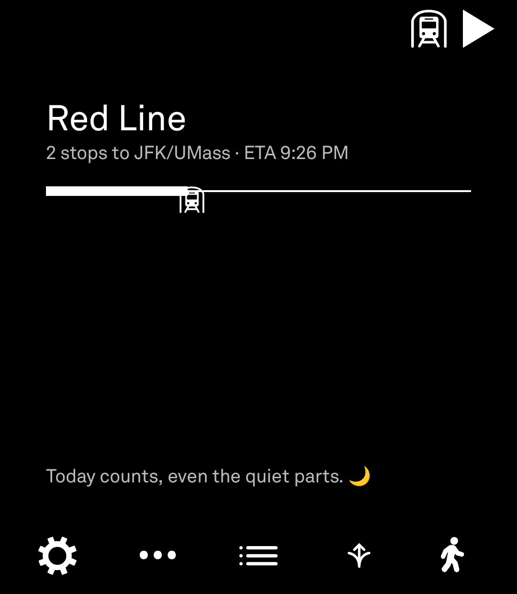

# 🚌 Pico Transit: Public Transit for the Light Phone III

Pico Transit is a friendly little companion for getting around on public transit: real schedules, live arrivals, connections at any stop, and a live map showing where your ride actually is. No ads, no clutter, no infinite scroll. Just "where's my bus," answered nicely. 🚏✨

It covers **110 feeds**. Live tracking works for **MBTA**, **RIPTA**, **RTD Denver** (with Bustang), **LTC** (London, Ontario), **STM Montréal**, **CTA**, **NYC Subway**, **LIRR**, **Metro-North**, NYC buses (all 5 boroughs plus MTA Bus Company), **Nashville's WeGo**, the SF Bay Area's 511.org agencies (BART, Muni, AC Transit, Caltrain, VTA, and dozens more), and all 9 **Puget Sound** agencies (King County Metro, Sound Transit, and more). The rest have schedules only for now: about 40 Colorado agencies, Metra, Pace, and LA Metro.

Use it on its own or alongside the Light Phone's Directions tool. It's built on the [Light SDK](https://github.com/lightphone/light-sdk), so it stays as calm and un-distracting as the rest of your Light experience.

## 🔄 Recent updates

**v0.4.1**
- 🌲 **Puget Sound, live**: King County Metro, Sound Transit, Pierce Transit, Community Transit, Kitsap Transit, Intercity Transit, Everett Transit, Washington State Ferries, and the Seattle Center Monorail now show live arrivals and vehicles, through Sound Transit's OneBusAway API.
- 🙏 **Clearer data credits**: King County Metro shows the credit King County asks for, and agencies whose data comes through Sound Transit or 511.org credit them alongside the agency.
- ⚙️ **Tidier Settings**: Clear schedule cache and Only download over Wi-Fi now sit right after the agency picker.
- ⌨️ **Keyboard update**: after typing a symbol or number, the keyboard switches back to letters, like the LightOS keyboard.

**v0.4.0**
- 🗺️ **Easier-to-read maps**: street names are drawn larger, and each map loads with about a quarter as many tile requests.
- 🚌 **CTA bus trips load much faster**: matching live buses to their scheduled trips no longer scans the whole schedule for every bus.
- 🔍 **Explore search stays put**: typing an address is no longer interrupted when the background location lookup finishes.
- 🔒 **A new home for live data**: the proxy moved to `gtfs.picotransit.com` and now only accepts the kinds of requests the app actually makes.

**Earlier**
- 🐛 **Steadier live tracking** on feeds with infrequent GPS updates. RIPTA also follows each vehicle along its real route path, so it catches up even when several stops pass between updates.
- 🎶 **Nashville's WeGo, live**: added in honor of Dolly Parton, with full live tracking from day one.

The full history is in [RELEASE_NOTES.md](RELEASE_NOTES.md).

## 🔭 Coming up

- 📍 **Real GPS for Explore**: built and working, but marked **(Testing)** until LightOS trusts non-Light-signed builds for location. Address search works in the meantime.
- ⚠️ **Service alerts**: detours and service changes from GTFS-RT's Alerts feed.
- 🗺️ **Route shapes on the map**: drawing the real path between stops instead of straight lines (RIPTA's shapes are already read).
- 🚏 **More agencies**, with help from the community.

## 🚏 Agencies and live data

Everything Pico Transit covers, and what each agency publishes live.

**Northeast & Canada**

| Agency | Schedule | Trip updates | Vehicle positions | Service alerts⁶ |
|---|:-:|:-:|:-:|:-:|
| MBTA¹ | ✓ | ✓ | ✓ | 🔜 |
| RIPTA | ✓ | ✓ | ✓ | — |
| LTC Ontario | ✓ | ✓ | ✓ | — |
| STM Montréal | ✓ | ✓ | ✓ | 🔜 |

**New York City**

| Agency | Schedule | Trip updates | Vehicle positions | Service alerts⁶ |
|---|:-:|:-:|:-:|:-:|
| NYC Subway | ✓ | ✓ | ✓⁵ | — |
| LIRR | ✓ | ✓ | ✓ | — |
| Metro-North | ✓ | ✓ | ✓ | — |
| NYC Bus - Bronx | ✓ | ✓ | ✓ | — |
| NYC Bus - Brooklyn | ✓ | ✓ | ✓ | — |
| NYC Bus - Manhattan | ✓ | ✓ | ✓ | — |
| NYC Bus - Queens | ✓ | ✓ | ✓ | — |
| NYC Bus - Staten Island | ✓ | ✓ | ✓ | — |
| NYC Bus - MTA Bus Company | ✓ | ✓ | ✓ | — |

**Chicago**

| Agency | Schedule | Trip updates | Vehicle positions | Service alerts⁶ |
|---|:-:|:-:|:-:|:-:|
| CTA | ✓ | ✓³ | ✓³ | — |
| Metra | ✓ | — | — | — |
| Pace | ✓ | — | — | — |

**Denver & Colorado**

| Agency | Schedule | Trip updates | Vehicle positions | Service alerts⁶ |
|---|:-:|:-:|:-:|:-:|
| RTD Denver² | ✓ | ✓ | ✓ | 🔜 |
| Bustang | ✓ | ✓ | ✓ | — |

**San Francisco Bay Area (via 511.org)**

| Agency | Schedule | Trip updates | Vehicle positions | Service alerts⁶ |
|---|:-:|:-:|:-:|:-:|
| BART | ✓ | ✓ | —⁴ | — |
| SFMTA Muni | ✓ | ✓ | ✓ | — |
| AC Transit | ✓ | ✓ | ✓ | — |
| Caltrain | ✓ | ✓ | ✓ | — |
| VTA | ✓ | ✓ | ✓ | — |
| County Connection | ✓ | ✓ | ✓ | — |
| ACE | ✓ | ✓ | ✓ | — |
| Santa Cruz METRO | ✓ | ✓ | ✓ | — |
| Capitol Corridor | ✓ | ✓ | ✓ | — |
| Emery Go-Round | ✓ | ✓ | ✓ | — |
| Golden Gate Transit | ✓ | ✓ | ✓ | — |
| Marin Transit | ✓ | ✓ | ✓ | — |
| Mission Bay TMA | ✓ | ✓ | ✓ | — |
| Mountain View Community Shuttle | ✓ | ✓ | ✓ | — |
| MVgo | ✓ | ✓ | ✓ | — |
| Petaluma Transit | ✓ | ✓ | ✓ | — |
| Rio Vista Delta Breeze | ✓ | ✓ | ✓ | — |
| SMART | ✓ | ✓ | ✓ | — |
| SF Bay Ferry | ✓ | ✓ | ✓ | — |
| San Leandro LINKS | ✓ | ✓ | ✓ | — |
| SamTrans | ✓ | ✓ | ✓ | — |
| Sonoma County Transit | ✓ | ✓ | ✓ | — |
| Santa Rosa CityBus | ✓ | ✓ | ✓ | — |
| SolTrans | ✓ | ✓ | ✓ | — |
| WestCat | ✓ | ✓ | ✓ | — |
| LAVTA Wheels | ✓ | ✓ | ✓ | — |
| Tri Delta Transit | ✓ | ✓ | ✓ | — |
| Angel Island Tiburon Ferry | ✓ | ✓ | ✓ | — |
| Commute.org Shuttles | ✓ | ✓ | ✓ | — |
| Dumbarton Express | ✓ | ✓ | ✓ | — |
| Emery Express | ✓ | ✓ | ✓ | — |
| FAST | ✓ | ✓ | ✓ | — |
| Golden Gate Ferry | ✓ | ✓ | ✓ | — |
| Presidio Go | ✓ | ✓ | ✓ | — |
| SFO Airport | ✓ | ✓ | ✓ | — |
| South San Francisco Shuttle | ✓ | ✓ | ✓ | — |
| Treasure Island Ferry | ✓ | ✓ | ✓ | — |
| Union City Transit | ✓ | ✓ | ✓ | — |
| Vacaville City Coach | ✓ | ✓ | ✓ | — |
| VINE Transit | ✓ | ✓ | ✓ | — |

**Nashville**

| Agency | Schedule | Trip updates | Vehicle positions | Service alerts⁶ |
|---|:-:|:-:|:-:|:-:|
| Nashville - WeGo Public Transit | ✓ | ✓ | ✓ | — |

**Los Angeles**

| Agency | Schedule | Trip updates | Vehicle positions | Service alerts⁶ |
|---|:-:|:-:|:-:|:-:|
| LA Metro | ✓ | — | — | — |

**Puget Sound**

| Agency | Schedule | Trip updates | Vehicle positions | Service alerts⁶ |
|---|:-:|:-:|:-:|:-:|
| King County Metro | ✓ | ✓ | ✓ | 🔜 |
| Sound Transit | ✓ | ✓ | ✓ | 🔜 |
| Pierce Transit | ✓ | ✓ | ✓ | 🔜 |
| Community Transit | ✓ | ✓ | ✓ | 🔜 |
| Kitsap Transit | ✓ | ✓ | ✓ | 🔜 |
| Intercity Transit | ✓ | ✓ | ✓ | 🔜 |
| Everett Transit | ✓ | ✓ | ✓ | 🔜 |
| Washington State Ferries | ✓ | ✓ | ✓ | 🔜 |
| Seattle Center Monorail | ✓ | ✓ | ✓ | 🔜 |

<details><summary><b>Colorado</b> (41 more agencies, schedules only)</summary>

| Agency | Schedule | Trip updates | Vehicle positions | Service alerts⁶ |
|---|:-:|:-:|:-:|:-:|
| All Points Transit | ✓ | — | — | — |
| Avon Transit | ✓ | — | — | — |
| Baca Area Transportation | ✓ | — | — | — |
| Bent County Transportation | ✓ | — | — | — |
| Blackhawk and Central City Tramway | ✓ | — | — | — |
| Boulder County | ✓ | — | — | — |
| Breckenridge Free Ride | ✓ | — | — | — |
| Bustang Outrider | ✓ | — | — | — |
| City of Fountain Transit | ✓ | — | — | — |
| Clear Creek County Transit | ✓ | — | — | — |
| Core Transit | ✓ | — | — | — |
| Dolores County | ✓ | — | — | — |
| Durango Transit | ✓ | — | — | — |
| Easy Ride Transportation | ✓ | — | — | — |
| El Paso Fountain Valley Senior Citizens Program Inc. | ✓ | — | — | — |
| Envida | ✓ | — | — | — |
| Epic Mountain Express | ✓ | — | — | — |
| Estes Transit | ✓ | — | — | — |
| Garden of the Gods | ✓ | — | — | — |
| Greeley-Evans Transit | ✓ | — | — | — |
| Gunnison Valley RTA | ✓ | — | — | — |
| Home James Transportation | ✓ | — | — | — |
| Mountain Metropolitan Transit | ✓ | — | — | — |
| Parachute Area Transit System | ✓ | — | — | — |
| Prairie Express Transit | ✓ | — | — | — |
| Pueblo Transit | ✓ | — | — | — |
| RFTA | ✓ | — | — | — |
| Road Runner Transit | ✓ | — | — | — |
| Rocky Mountain National Park Shuttles | ✓ | — | — | — |
| San Miguel Authority for Regional Transportation | ✓ | — | — | — |
| Snowmass Village Transportation | ✓ | — | — | — |
| Steamboat Springs Transit | ✓ | — | — | — |
| Summit Stage | ✓ | — | — | — |
| Town of Mountain Village | ✓ | — | — | — |
| Town of Telluride | ✓ | — | — | — |
| Transfort | ✓ | — | — | — |
| TSC Transit | ✓ | — | — | — |
| University of Colorado Boulder | ✓ | — | — | — |
| Vail Transit | ✓ | — | — | — |
| Via Mobility | ✓ | — | — | — |
| Winter Park Transit | ✓ | — | — | — |

</details>

¹ MBTA Green Line trains are matched to the schedule as a "closest match", since most run as unscheduled added trips. Commuter rail positions and track numbers come from MBTA's V3 API.  
² RTD Denver includes Bustang's routes and live vehicles.  
³ CTA doesn't publish standard GTFS-RT. Buses use CTA Bus Tracker (predicted arrivals and positions, matched to scheduled trips). 'L' trains use Train Tracker as a "closest match" for live arrivals and boarded trips, and aren't drawn on the map yet.  
⁴ BART publishes no vehicle positions; arrivals come from trip updates.  
⁵ NYC Subway trains have no GPS, so they're shown at their current stop.  
⁶ Service alerts are coming in a future update. 🔜 means the agency's alerts feed is connected and ready.

## 🗺️ What can it do?

- 🏠 **Pick your agency** from the welcome screen and Pico Transit downloads its schedule to your phone. The home screen then shows a clock in the agency's timezone and its name.

  
  

- 🗂️ **Multiple schedules by region**: New York City, Denver, the SF Bay Area, and Puget Sound group their agencies together. Turn on more schedules from the same region in Settings → "Additional Schedules", and tap and hold one there to make it your primary.

  

- 📅 **Schedules**: browse by Subway 🚇, Commuter Rail 🚆, or Bus 🚌, then pick a route, direction, and stop to see today's departures. Tap the Departures header to see tomorrow's instead.

  

  Routes for each supported agency:

  
  
  
  
  

- 🔗 **Connections**: tap any stop along a trip to see what comes through there next, across every platform of a station. Handy for planning a transfer on the fly.

  

- 📍 **Explore**: the closest stops to you, nearest first (**Testing**, see above). Search for a different address or landmark any time, and Recenter to come back to your own location.

  
  

- ⏱️ **Live ETAs** with On Time / Late / Early badges, whenever the agency's live feed is playing along nicely.

  

- 🗺️ **Map**: your stop and the stops around it, with live vehicles shown by mode (subway/light rail, commuter rail, bus, ferry). "See everything" shows every live vehicle in view; filter it by stop or by mode.

  
  

- 👆 **Gestures**: tap and hold a stop or station name to jump to its live arrivals. On the map, double-tap a station to zoom into its platforms, and double-tap its name to zoom back out. On Trip Detail, a tap opens a stop's connections and tap-and-hold opens its arrivals; once you've boarded, a tap sets where you're getting off.

- 🚉 **Stations**: one entry per real station, with a map of just its platforms and gates. MBTA commuter rail trains show up on their track once one is assigned, usually 10-15 minutes before departure.

  

- ▶️ **Board a trip**: tap Play on Trip Detail, then tap the stop where you're getting off. When you arrive, Pico Transit celebrates with "You've reached your stop! 🎉" and shows that stop's upcoming arrivals.

  
  

- 👀 **Show earlier stops** (Settings): a boarded trip also lists the stops before yours, greyed out, so you can watch your vehicle approach.

  

- 🚋 **Select Run**, for CTA 'L' trains and MBTA Green Line: their live feeds can't be matched to a scheduled trip for certain, so Pico Transit shows a "Closest match". Select Run lets you confirm or correct it by tapping the vehicle you're actually on.

  

- 🚦 **Home screen trip status**: while you're on a trip, the home screen shows your route, live ETA, stops remaining, and an optional progress bar.

    
    

- ↩️ **Jump back anytime**: a Play icon in the corner takes you back to your trip from any screen, and the footer circle takes you home.

  

- ⚙️ **Settings**: switch agencies, pick a light or dark map, choose gestures, turn Select Run options on or off, manage location, download only over Wi-Fi (on by default), or clear the schedule cache.

  
  

- ℹ️ **About**: a legend of every icon Pico Transit uses.

  

## 🛠️ Building & running it

Pico Transit lives in `tool/` inside this fork of the [light-sdk](https://github.com/lightphone/light-sdk) monorepo. Follow the SDK's own setup first (GitHub token, Android Studio, and so on), then:

1. Open the project in Android Studio.
2. Run the `:tool` module on an emulator, or on [the LightOS emulator](docs/system_app). [`tool/lighttool.toml`](tool/lighttool.toml) targets a real phone (`com.lightos`) by default; switch `serverPackage` to the commented-out emulator line when running there.
3. Pick an agency, grab a coffee ☕ while the schedule downloads, and you're off.

## 📱 Getting it onto a *real* Light Phone III

Until Pico Transit is available through Light's Tool Library, install it with ADB, since LightOS can't install third-party APKs on the phone itself yet:

1. Download the latest APK from [Releases](https://github.com/CJFData/light-transit/releases), or build one with `./gradlew :tool:assembleDebug`.
2. Turn on Developer Options and USB debugging on your Light Phone III, plug it in, and run:
   ```bash
   adb install -r pico-transit-<version>.apk
   ```
3. On the phone, allow "Any tools" in LightOS's tool settings. It'll warn you the tool isn't Light-vetted yet, which is expected for now. 🚧

That's it, happy transit-ing! 🚏🚌🚆

## 🧪 A few nerdy notes

- **Live data goes through `pico-transit-proxy`**, a small Cloudflare Worker at `gtfs.picotransit.com` (in its own repo). It only fetches a fixed list of upstream URLs, keeps every API key server-side, caches responses so riders share upstream requests, and accepts only the kinds of requests the app makes.
- **HTTP-only feeds** (RIPTA, LTC) reach the app over HTTPS through the proxy, so the app never uses cleartext.
- **Explore's GPS** uses the Light SDK's location APIs. Address search uses Nominatim (OpenStreetMap), so please be kind to their free API! 🙏
- **Stations are grouped by GTFS `parent_station`**, so a big hub shows up once. Entrances, elevators, and escalators are left out of its platform map.
- **Boarding is a saved reference, not a background tracker.** Live feeds are only polled while Trip Detail or the home screen is on screen.
- **Agency APIs fill gaps in GTFS-RT**: MBTA's V3 API provides commuter rail tracks and positions, and CTA's Bus Tracker is matched to scheduled trips by route and scheduled start time.
- **"Closest match"** pairs live CTA 'L' runs and MBTA Green Line trips with the nearest scheduled trip in order, since neither can be matched exactly. These aren't plotted on the map yet.
- **NYC Subway's 8 line-group feeds** are merged by the proxy into one, and their trip IDs are decoded back to real scheduled trips.
- **The SF Bay Area shares one upstream feed**: 511.org publishes one regional feed, which the proxy fetches once and slices per agency.
- **Map tiles** come from CARTO through the proxy. Each 512px tile is cut into four, which keeps requests down and makes street names easier to read.

## 🙌 Credits

Thanks to [Jose Briones](https://github.com/jbriones95) for his continued support integrating RTD Denver and Colorado transit into Pico Transit.

Thanks to [Guy Dupont](https://github.com/dupontgu) on the Light team for adding `LightConnectivity` to `light-sdk`, the network-state API that made the "Only download over Wi-Fi" setting possible, and to the whole Light Phone team for making this SDK a genuine pleasure to build on and the LightOS developer community such a positive, supportive place to be.

Thanks to Claude (Anthropic) for extensive collaboration throughout Pico Transit's development, including learning Kotlin from scratch, implementing the "Only download over Wi-Fi" setting, and working through the codebase's comments and documentation together.

## 📄 License

The [`tool/`](tool/) directory (Pico Transit itself) is licensed separately from the rest of the monorepo: see [`LICENSE-TRANSIT`](LICENSE-TRANSIT) (MIT, © Christian Ferreira / CJFData). The rest of `light-sdk` remains under its own [`LICENSE`](LICENSE) (MIT, © The Light Phone).
